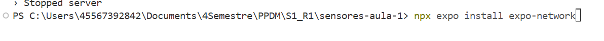
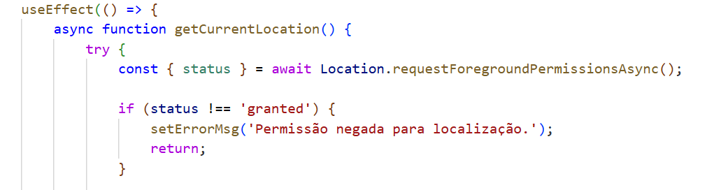
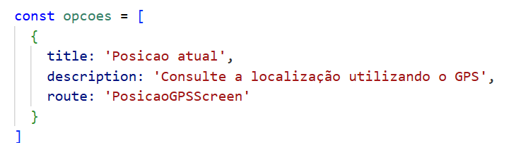
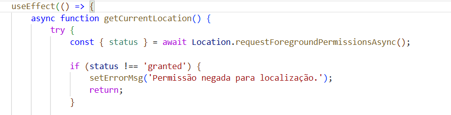
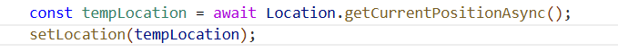
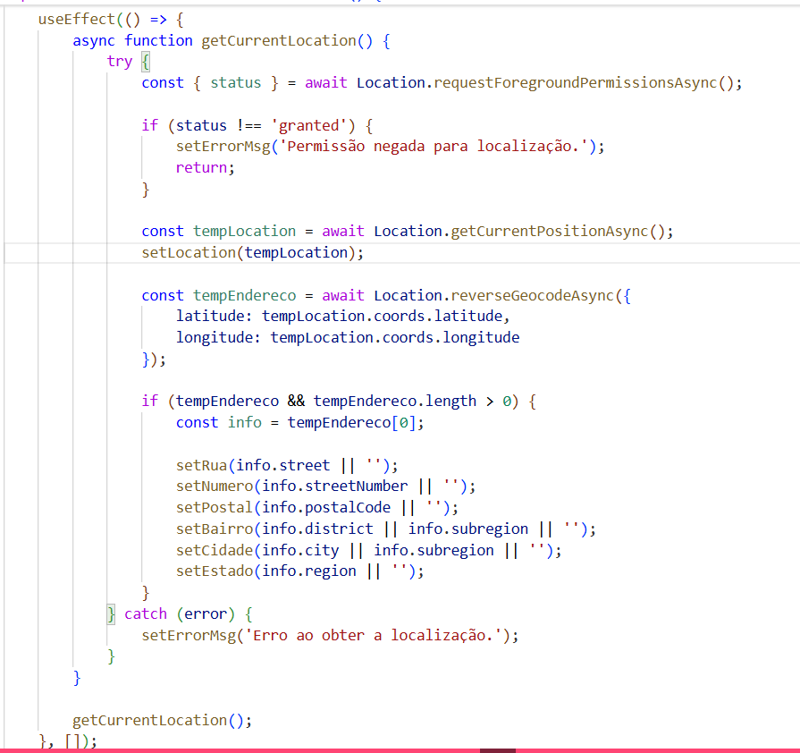
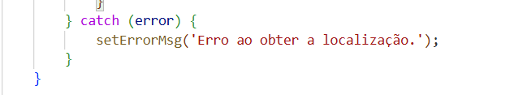

# Localização (GPS) com Expo — `expo-location`
Esse documento explica como configuramos e usamos a biblioteca `expo-location` no app, especificamente na tela `PosicaoGPSScreen`, que pega a posição atual do usuário via GPS e transforma isso em um endereço legível.

## 1. Por que essa biblioteca
Precisávamos que o app soubesse "onde o usuário está" sem depender de digitação manual. O `expo-location` resolve isso de duas formas: pega as coordenadas brutas e também faz a geocodificação reversa, ou seja, transforma essas coordenadas em rua, bairro, cidade etc.

## 2. Instalação
Usamos o CLI do próprio Expo em vez do `npm install` direto, porque ele já resolve a versão certa da biblioteca de acordo com o SDK do projeto:

## 3. Permissões
Na nossa implementação, a permissão não é declarada em app.json, ela é pedida em tempo de execução, direto no código, logo no início do useEffect da tela, com Location.requestForegroundPermissionsAsync(). Isso pergunta ao usuário se ele permite o acesso ao GPS. 

## 4. Como a navegação chega até a tela
A `HomeScreen` funciona como um menu: ela lista os recursos disponíveis do dispositivo e navega até a rota correspondente quando o card é tocado.

## 5. O fluxo dentro de `PosicaoGPSScreen`
Tudo acontece dentro de um `useEffect`, em três passos que dependem um do outro.

### 5.1 Pedir permissão

Se o usuário negar, a gente já para por aqui e mostra a mensagem de erro, não faz sentido tentar os próximos passos.

### 5.2 Pegar as coordenadas

### 5.3 Transformar coordenadas em endereço
Usamos `|| ''` em quase todos os campos porque o `reverseGeocodeAsync` nem sempre retorna todas as informações, depende muito da região e da qualidade do sinal.

### 5.4 Tratamento de erro

Um `try/catch` único envolve os três passos. Não tentamos diferenciar qual etapa falhou porque, para o usuário final, a mensagem "não deu pra pegar sua localização" já é suficiente.

## 6. Estados da tela
A tela pode estar em três momentos diferentes: se `errorMsg` tiver algum valor, mostra o texto de erro em vermelho; se já tiver `location`, mostra as coordenadas e o endereço; e se nenhum dos dois aconteceu ainda, fica só o "Aguardando localização..." na tela. Isso é importante pra não deixar a tela em branco ou parecendo travada enquanto o GPS ainda tá sendo consultado, o que pode levar alguns segundos dependendo do dispositivo.
