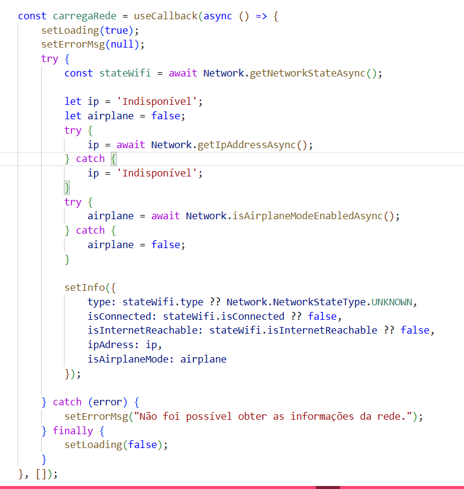
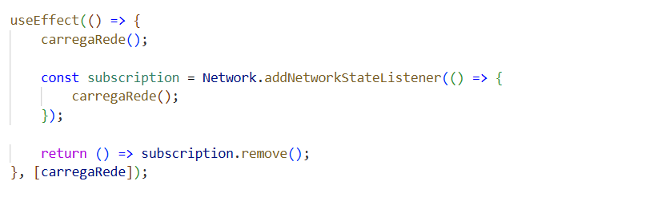
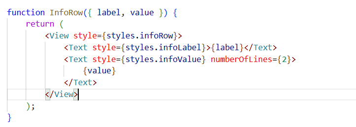

# Rede/Wi-Fi com Expo — `expo-network`
Esse documento explica a configuração e o uso da biblioteca `expo-network` na tela `RedeWifiScreen`, que mostra o status da conexão de rede do dispositivo em tempo real.

## 1. Por que essa biblioteca
A ideia era ter uma tela simples que respondesse "o dispositivo está conectado? a que tipo de rede? tem internet de verdade?", sem precisar o usuário sair do app pra checar isso nas configurações do sistema.

## 2. Instalação

## 3. Permissões
Diferente do GPS, aqui não precisamos configurar nada de permissão explícita. As informações básicas de rede já são liberadas por padrão pelo sistema. O Expo cuida sozinho de incluir a permissão `ACCESS_NETWORK_STATE` no Android na hora de empacotar o app.

## 4. Centralizando a lógica em uma função
Em vez de espalhar a busca de dados de rede em vários lugares, colocamos tudo em uma função só, `carregaRede`, memorizada com `useCallback`:

Assim conseguimos chamar essa mesma função tanto quando a tela abre quanto sempre que a rede mudar, sem duplicar código.

## 5. Atualização automática quando a rede muda
O `addNetworkStateListener` dispara `carregaRede()` toda vez que o dispositivo troca de rede. O `return () => subscription.remove()` é importante para não deixar o listener "vivo" depois que a tela é desmontada.

## 6. O componente `InfoRow`
Como a tela mostra cinco informações no mesmo formato (rótulo + valor), extraímos isso num componente pequeno em vez de repetir o mesmo JSX cinco vezes:

## 7. Estados da tela
A tela pode estar em três situações diferentes:
- Ainda não chegou resposta (`loading && info === null`), aparece só o spinner com "Consultando a rede...".
- Se algo deu errado (`errorMsg` tem valor), mostra o card vermelho com o erro.
- Quando os dados chegam (`info` preenchido), aparece o card com o status da conexão e as informações nas `InfoRow`.

